# How to setup a VPC for static webpages using Digital Ocean
This guide assumes you have a Digital Ocean account and have created a new project

# Step 1 Create a new VPC on digital ocean
1. Go to the Digital Ocean control panel
2. Click on the Networking tab
3. Click on the VPC folder
4. Click on Create VPC
5. Choose a location local to you
6. Leave everything default but the VPC name. Change this to wahtever you wish
7. Click Create VPC
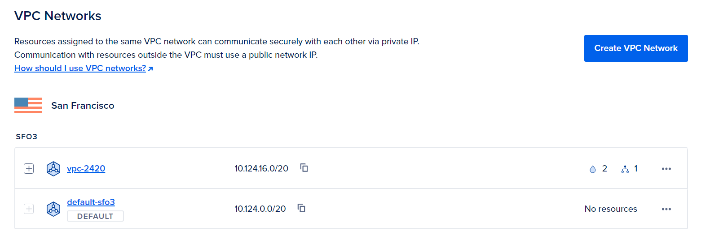

# Step 2 Create 2 new droplets
1. Under a project, click on the Droplets tab
2. Click on Create Droplet
3. Choose ubuntu 20.04
4. Choose the same location as the VPC
5. Under VPC networks, choose the VPC you just created
6. Add a tag to the droplet. This will be used to identify the droplet later
7. Click Create Droplet
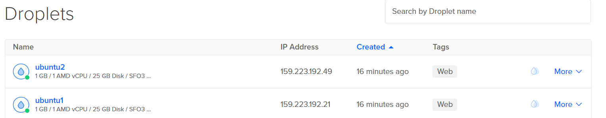

# Step 3 Create a load balancer
1. Go back to the networking tab, click on the Load Balancers tab
2. Click on Create Load Balancer
3. Choose a name for the load balancer
4. Choose the same location as the VPC
5. Under VPC networks, choose the VPC you just created
6. To connect droplets, type in the tag you added to the droplets in step 2
7. Click Create Load Balancer
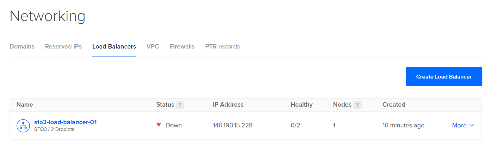

# Step 4 Create a Firewall
1. Click on the firewall tab
2. Click on Create Firewall
3. Choose a name for the firewall
4. Under inbounding rules, select HTTP and choose the load balancer you created in step 3
5. Enter the tag you added to the droplets in step 2
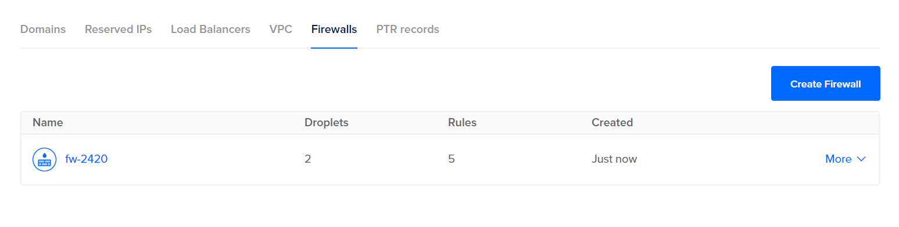

# Step 5 Create users in both droplets
Give both users sudo privileges

# Step 6 Install webserver on both droplets and install Caddy
1. Download Caddy from github using wget `wget https://github.com/caddyserver/caddy/releases/download/v2.6.2/caddy_2.6.2_linux_amd64.tar.gz`
2. Unzip the file `tar -xvf caddy_2.6.2_linux_amd64.tar.gz`
3. Change the owner of the file to root `sudo chown root: caddy`
4. Move the file to the bin folder `sudo mv caddy /usr/bin/`
5. Create 2 folders. One folder will be named html and the other src. The html folder will store the html files and the src folder will store the source code. Create appropriate index.html and js files in their respective folders. Ensure you install the necessary dependencies for the js files.
##### you must initialize npm and install fastify
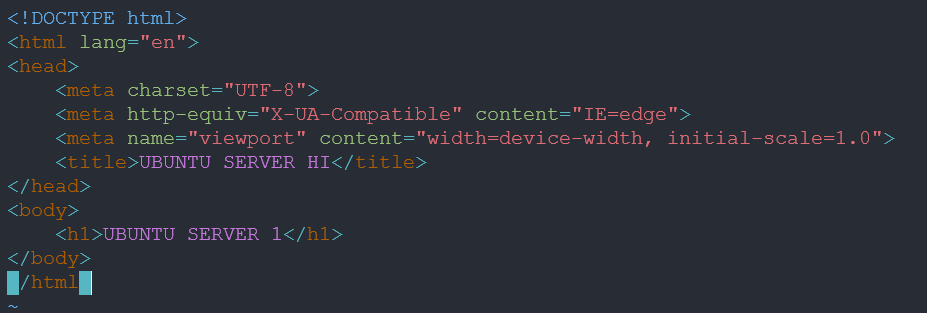
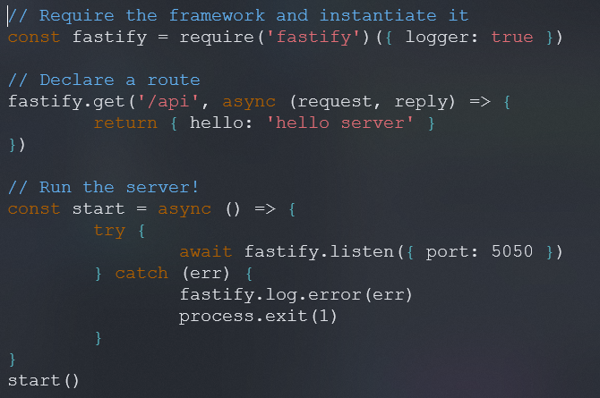
6. Create a caddyfile called Caddyfile
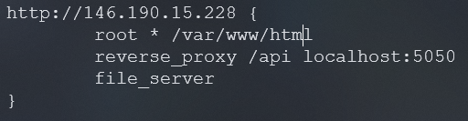
7. Install npm with Volta on both droplets with
`curl https://get.volta.sh | bash`
`source ~/.bashrc`
`volta install node`
`which npm`
`volta install npm`
8. Move the html and src directories you made in step 5 to the /var/www/ folder on both machines.
Then move the Caddyfile to /etc/caddy/
9. Create a unit file in `/etc/systemd/system/caddy.service`
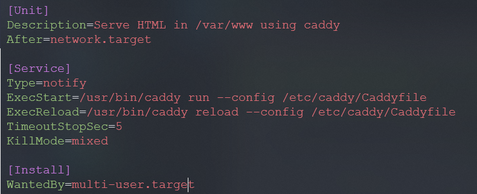
10. Create another unit file in `/etc/systemd/system/hello_web.service`
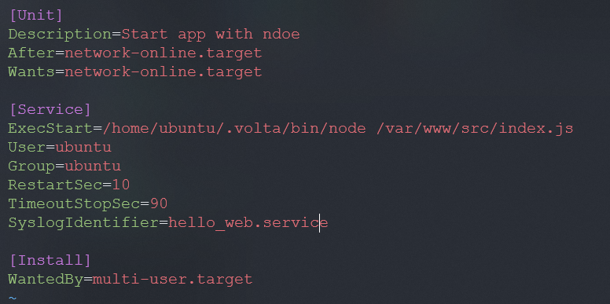
11. Start and enable both services using systemctl. Make sure you daemon-reload before starting the services
12. Do `sudo systemctl reload caddy` and test if the application is working by typing in the load balancer IP address in your browser.
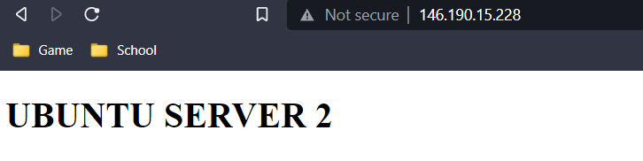
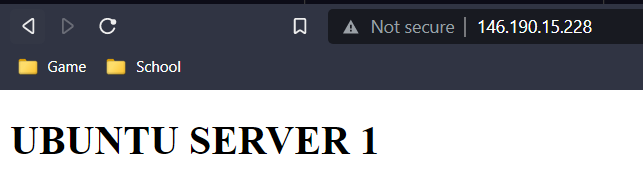
##### Reloading the page should show both droplets being used

# Step 7 CELEBRATE
You have now succesfully installed a static webpage on Digital Ocean using Caddy and a load balancer.

# Author
Jack Tam